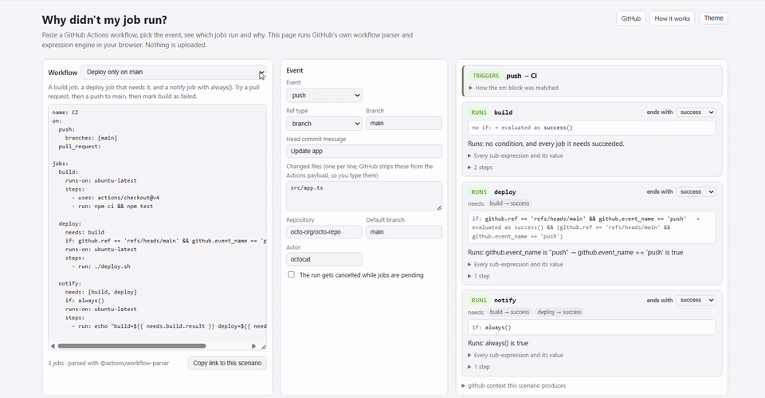

<h1 align="center">Why didn't my job run?</h1>

<p align="center"><b>Paste a GitHub Actions workflow, pick the event, see which jobs run and why.</b><br>GitHub's own workflow parser and expression engine, running in your browser. Nothing is uploaded.</p>

<p align="center">
  <a href="https://barbarkaragul-oss.github.io/why-didnt-my-job-run/">Open the simulator</a> ·
  <a href="#how-it-works">How it works</a> ·
  <a href="#verified-against-real-runs">Verified against real runs</a> ·
  <a href="#limits">Limits</a>
</p>

<p align="center">
  <a href="https://github.com/barbarkaragul-oss/why-didnt-my-job-run/actions/workflows/ci.yml"></a>
  
</p>

<p align="center">
  <a href="https://barbarkaragul-oss.github.io/why-didnt-my-job-run/"></a>
</p>

Every GitHub Actions user has stared at a grey "skipped" job and asked why. The usual answer is a dozen "test ci" commits. This page answers in a second: paste the workflow, choose `push` to `main` or a `pull_request` from a fork with a `release` label or a `workflow_dispatch` with `deploy: true`, and every job turns green or grey with the reason next to it, down to the value of each sub-expression.

```
if: github.event.pull_request.head.repo.fork == false
→ SKIPPED on pull_request from a fork:
  github.event.pull_request.head.repo.fork is true → github.event.pull_request.head.repo.fork == false is false
→ RUNS on push (probably not what you meant):
  github.event.pull_request.head.repo.fork is null → null == false is true
  (loose equality: null and boolean are compared as numbers, null/false/'' count as 0)
```

## What it does

- **Trigger decision.** Does this event start the workflow at all? `on:` filters are applied in the documented order: activity types (and the pull_request default of opened/synchronize/reopened), `branches` / `branches-ignore`, `tags` / `tags-ignore`, `paths` / `paths-ignore`, with GitHub's pattern syntax (`*`, `**`, `?`, `+`, `[]`, `!` negation with ordering). Each rule reports what it matched.
- **Job decisions in dependency order.** Every job's `if:` is evaluated by GitHub's own expression package, including the implicit `success() &&` wrapper its parser adds to a condition that has no status function, with `needs.<job>.result` and the status functions computed from every job upstream: the recorded runs show `success()` and `failure()` look at all ancestors, not only the direct `needs`. Mark a job as failed or cancelled to see what `failure()`, `always()` and `!cancelled()` do downstream.
- **Why.** The decisive comparison is named with both sides' values, and a note explains coercions (`null == false` is true, `inputs.deploy == 'true'` is false for a boolean input, string comparison is case-insensitive). Expand a job to see every sub-expression and its value.
- **Things GitHub rejects.** `hashFiles()` or `matrix` in a job-level `if:`, `branches` together with `branches-ignore`, unknown keys: the file is reported as GitHub would reject it and every job is marked not run, as the recorded hashFiles runs show (a failed run named after the file, with no jobs, sibling jobs included). A filter list with only negative patterns is different: GitHub creates no run at all, and the trigger card says so.
- **The context you get.** The `github` context for the scenario, derived per event as documented (`refs/pull/N/merge` for pull requests, the base branch for `pull_request_target`, the default branch for `issues` and `schedule`, the tag for `release`), with the GitHub Docs description of every field on hover.
- **Share.** One link carries the workflow and the scenario, compressed into the URL fragment.

## How it works

GitHub publishes the pieces of its Actions language server as MIT-licensed npm packages:

- [`@actions/workflow-parser`](https://www.npmjs.com/package/@actions/workflow-parser) parses the YAML against the real workflow schema and fills in the documented defaults: a job without `if:` gets `success()`, a job with `if: x` gets `success() && (x)`, invalid keys are errors.
- [`@actions/expressions`](https://www.npmjs.com/package/@actions/expressions) is the `${{ }}` engine: lexer, parser, evaluator, coercion rules, `contains`, `startsWith`, `format`, `fromJSON`, object filters.

Both are pure JavaScript with no Node dependencies, so this page bundles them and runs them in the browser (about 600 KB, no server, no key). What is written here is only what the packages do not cover:

| Piece | Where | Source of truth |
|---|---|---|
| `on:` filter matching | `src/engine/filters.ts` | the docs' filter cheat sheet, every example of which is a test |
| `github` context per event | `src/engine/context.ts` | the docs' events table, plus real contexts recorded from runs |
| status functions from every ancestor | `src/engine/evaluate.ts` | real runs: two chain workflows and a step workflow |
| sub-expression trace | `src/engine/evaluate.ts` | a subclass of GitHub's evaluator that records every node |
| context availability | `src/engine/availability.ts` | the docs' context-availability table, confirmed by a rejected workflow in the fixtures repo |

The example payloads come from GitHub's [`@octokit/webhooks-examples`](https://www.npmjs.com/package/@octokit/webhooks-examples); the scenario knobs patch them.

## Verified against real runs

Documentation can be read two ways; a run cannot. A private fixtures repository ran a workflow with 31 deliberately tricky jobs (32 rows as GitHub lists them, since the matrix job has two legs: fork checks, label checks, `null == false`, `inputs.deploy == 'true'`, `needs` chains with a failing build, `always()`, `!cancelled()`, `needs.x.result == 'skipped'`, `github.run_attempt == 1`, case-insensitive `ref_name == 'MAIN'`, a job-level `hashFiles()`) on real pushes to branches and tags, pull requests (opened, labeled, draft), two manual dispatches, a release and a labelled issue. Each run dumped its own `toJSON(github)`; the API reported each job's conclusion. Two more workflows chained jobs three deep behind a failing job and behind a job skipped by its own condition, and one tested step-level conditions. `tests/fixtures/runs/` holds 65 recordings (21 of the 31-job workflow with its full `github` context, the chain and step workflows, six filter workflows, and 14 failed runs of rejected files) and `tests/replay.test.ts` requires the simulator to reproduce 698 job run-or-skip decisions and 56 trigger decisions. `npm test` runs them.

Four things the runs pinned down. Status functions look at every ancestor, not just `needs`: `success()` is false, and a job with no `if:` is skipped, when any job upstream was skipped or failed, even three hops away and even when the direct need succeeded, so `always()` rescues only the job it is on; `failure()` is true when any ancestor failed, even when the direct need was skipped. Step-level `success()` and `failure()` look at the job's own steps, not at `needs`: in an `always()` job after a failed need, a step with `if: failure()` is skipped and one with `if: success()` runs. The push payload GitHub hands to Actions has no file lists: the docs say so in a note under the push event, and the recordings show the exact keys of `head_commit` and `commits[]` (author, committer, distinct, id, message, timestamp, tree_id, url), so changed files are something you type, in this tool and in any other. And a job-level `hashFiles()` is a validation error that fails the whole file with zero jobs, sibling jobs included, rather than skipping just that job.

## Run it locally

```bash
git clone https://github.com/barbarkaragul-oss/why-didnt-my-job-run && cd why-didnt-my-job-run
npm install
npm test          # docs-derived filter tests + ground-truth replay
npm run build     # docs/ (the static site)
npm run dev       # rebuild on change; serve docs/ with any static server
```

`npx tsx scripts/record-fixtures.ts` re-records the fixtures from the private repository (needs access to it); `scripts/build-payloads.ts` refreshes the example payloads from the npm package.

## Limits

- **Changed files are typed by you.** GitHub strips added/modified/removed lists from the push payload it gives to Actions, so no simulator can read them from the event.
- **Matrix expansion is not simulated yet**; a matrix job is decided once, as on GitHub (the job-level `if:` runs before expansion), and its legs are not listed.
- **Reusable workflow jobs** are decided but not expanded.
- **Step conditions** are evaluated with the job's own step status and every previous step assumed to have succeeded (the recorded runs confirm step-level `success()`/`failure()` look at the job's steps, not at `needs`); a step whose condition reads `steps.<id>.*`, `env`, `matrix` or `hashFiles()` is marked unknown rather than guessed.
- **Not simulated:** concurrency groups, required checks, environment protection rules, `workflow_run` chains, timeouts.
- `pull_request_target` sets `github.ref` to the base branch; the docs' events table says default branch. The two agree when the PR targets the default branch; the tool follows the contexts page and says so.

Wrong result? [Open an issue](https://github.com/barbarkaragul-oss/why-didnt-my-job-run/issues/new) with the workflow and the event; if a real run disagrees with the simulator, that run becomes a fixture.

## License

MIT. The GitHub Actions packages are MIT-licensed by GitHub; the webhook examples are MIT-licensed by Octokit.
